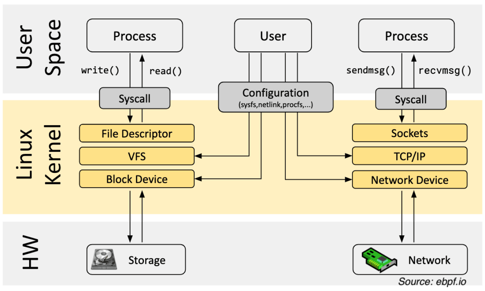

# 1.1 리눅스 커널구조와 역할 이해

1. 커널의 전반적인 구조 

```sql
+------------------------------+
|      사용자 공간 (User Space)|
|  - Shell, bash, vim, curl   |
|  - nginx, python, go 앱 등  |
+------------------------------+
            ↓ (시스템 호출)
+------------------------------+
|         커널 공간 (Kernel Space)         |
| +--------------------------+ |
| |  1. 시스템 콜 인터페이스 | |
| +--------------------------+ |
| |  2. 프로세스/스레드 관리 | |
| |  3. 메모리 관리         | |
| |  4. 파일 시스템         | |
| |  5. 네트워크 스택       | |
| |  6. 드라이버 (장치 제어) | |
| |  7. 보안/감시 모듈 (LSM)| |
| +--------------------------+ |
+------------------------------+
```

1. 주요 구성 요소
    1. 시스템 콜 인터페이스 (System Call Interface)
        1. user space: 커널 space로 진입하는 관문
        2. read( ), open( ), execve( ) 등 호출 처리
        3. → 여기가 바로 eBPF 나 seccomp 등이 후킹하는 지점
    2. 프로세스 및 스케줄러
        1. task_struce 를 통해 프로세스 상태 관리
        2. 스케줄러가 CPU 점유를 조절함(CFS, RT, BFS 등) → context switching, fork, thread 를 관리
            1. CFS (Completely Fair Scheduler)
                1. 리눅스의 기본 스케줄러 (2.6.23 이후)
                2. "공정함(Fairness)"을 목표로 한 **가중치 기반 타임 공유 방식**
                3. 선점형, 각 프로세스는 `vruntime`이라는 가상 실행 시간을 가짐
                4. `vruntime`이 가장 작은 프로세스가 다음에 실행됨 → 덜 실행된 프로세스를 우선함
                5. Red-Black Tree로 관리 → 효율적인 정렬과 선택
                6. 대부분의 일반적인 Linux 배포판에서 기본 사용됨
            2. RT (Real-Time Scheduler)
                1. 실시간 처리가 필요한 프로세스를 위한 **고정 우선순위 스케줄러**
                2. 리눅스에는 두 가지 실시간 정책이 존재함
                    1. `SCHED_FIFO`: 우선순위가 가장 높은 태스크가 먼저 실행, 선점 없음
                    2. `SCHED_RR`: 라운드 로빈 방식으로 같은 우선순위 내에서 시간 분할
                3. 응답 지연(latency)을 최소화하는 데 초점, 시스템 자원이 부족할 경우 실시간 태스크가 **비실시간 태스크를 굶기게(hang)** 할 수 있음
                4. 실시간 미션 크리티컬 시스템에서 사용 (예: 로봇, 오디오 시스템, 통신 기지국 등)
            3. BFS (Brain Fuck Scheduler)
                1. **저지연 데스크탑용** 스케줄러로, 2009년 Con Kolivas가 개발, 코드가 매우 단순 (500줄 이하)하며 직관적인 라운드로빈 방식 사용
                2. 멀티태스킹 적은 환경 (개발용 데스크탑, 음악 작업 등)에 유리
                3. Red-Black Tree 같은 복잡한 자료구조 제거
                4. CFS보다 반응속도 좋지만 확장성은 떨어짐
                5. **공식 커널에는 포함되지 않음** → 별도 패치 필요
    3. 메모리 관리
        1. 가상 메모리 — 실제 물리 메모리 매핑
        2. 페이징, 스왑, 캐시 관리, 메모리 보호
        3. Slab/SLUB 할당자 구조 → mmap( ), brk( ), 페이지 폴트 처리
    4. 파일시스템(VFS, Virtual File System)
        1. 리눅스는 모든 것을 파일로 관리함
        2. ext4, xfs, nfs, procfs, sysfs 등 다양한 파일시스템을 추상화하여 관리
        3. open( ), read( ), write( ) 요청을 하드웨어와 연결
    5. 네트워크 스택
        1. TCP/IP 스택 내장: IPv4, IPv6, UDP, TCP, ICMP, …
        2. 소켓 API → 내부 커널 네트워크 처리
        3. 방화벽(Netfilter), 트래픽 제어(TC), 패킷 필터링(XDP) → eBPF가 관찰 및 제어할 수 있는 영역
    6. 디바이스 드라이버
        1. 하드웨어와 통신하는 코드
        2. USB, GPU, NIC, Block device, I2C, …
        3. 커널 모듈로 동적 삽입/제거 가능 → /dev/ 하위에 파일로 위치하며 사용자 공간에 노출됨
    7. 보안 및 모니터링 모듈
        1. **LSM (Linux Security Module)**: SELinux([https://ko.wikipedia.org/wiki/보안_강화_리눅스](https://ko.wikipedia.org/wiki/%EB%B3%B4%EC%95%88_%EA%B0%95%ED%99%94_%EB%A6%AC%EB%88%85%EC%8A%A4)), AppArmor([https://apparmor.net/](https://apparmor.net/)), seccomp([https://www.kernel.org/doc/html/v4.16/userspace-api/seccomp_filter.html](https://www.kernel.org/doc/html/v4.16/userspace-api/seccomp_filter.html))
        2. Capabilities: root 권한을 세분화한 보안 모델
        3. audit subsystem: 시스템 활동 로깅
        4. → eBPF 기반 보안 도구 (Tetragon, Falco 등)의 주요 타겟
2. 커널 구조의 특징

| 특징 | 설명 |
| --- | --- |
| **모놀리식 커널** | 모든 핵심 기능이 하나의 커널 바이너리에서 동작 (vs 마이크로커널) |
| **모듈화 지원** | `insmod`, `rmmod`로 기능 추가 가능 (`*.ko`) |
| **선점형 스케줄링** | 실시간 커널은 고정 시간 안에 작업 수행 보장 |
| **이식성** | 다양한 아키텍처(ARM, x86, RISC-V 등)에 포팅 가능 |
| **네임스페이스, cgroup** | 컨테이너 기술의 기반 기능 |



kernel and userspace : from [https://ebpf.io/what-is-ebpf/](https://ebpf.io/what-is-ebpf/)
