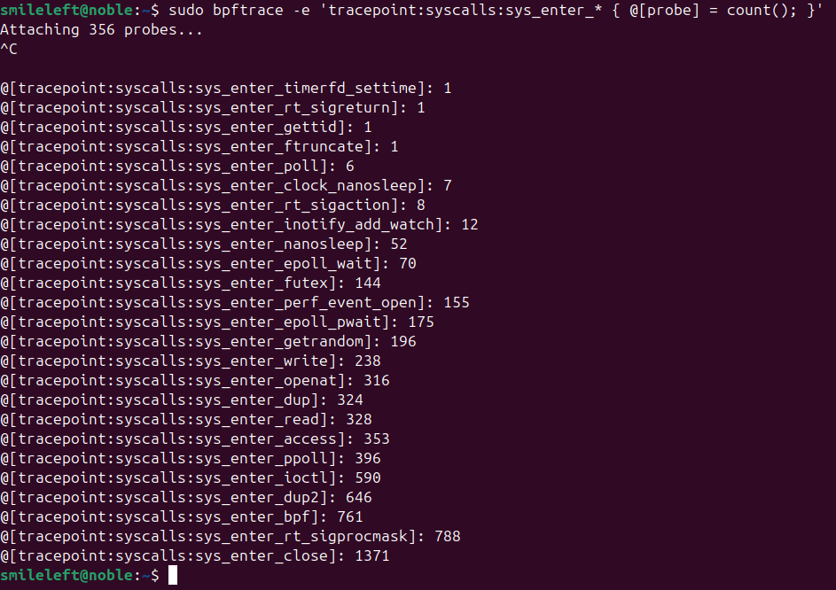
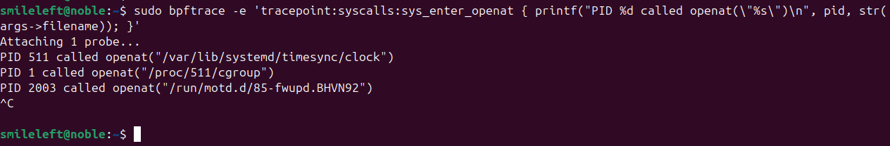
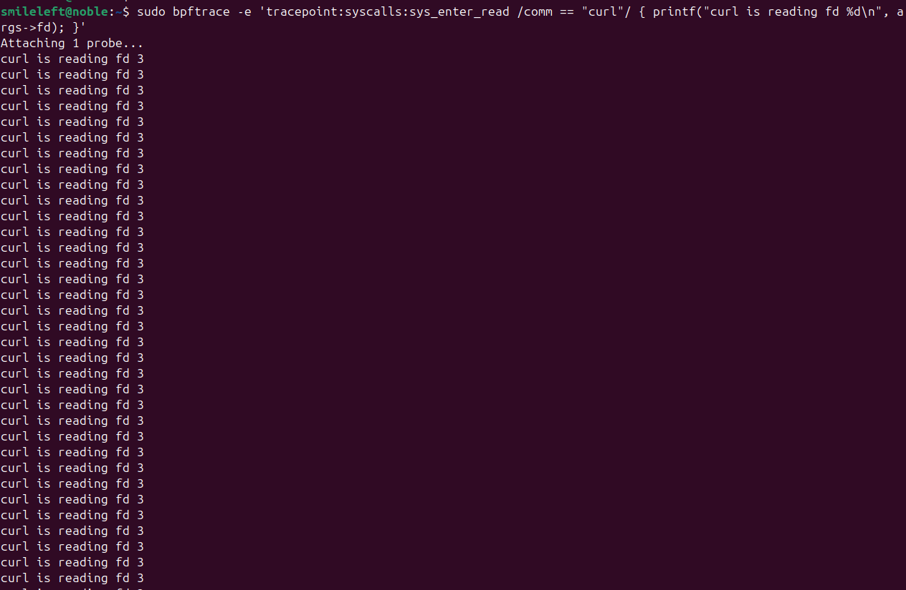

# 1.2 시스템 호출(System Call)과 커널 이벤트 개념

## 1. 시스템 호출 (System Call)

### ✅ 개념

시스템 호출은 **유저 공간(user space)** 프로그램이 **커널 공간(kernel space)**의 기능을 요청할 때 사용하는 공식적인 진입점.

- 사용자 프로그램은 파일 열기, 읽기, 쓰기, 네트워크 전송, 메모리 할당 등 **하드웨어 접근이 필요한 작업**을 직접 할 수 없슴.
- 대신 `open()`, `read()`, `write()` 같은 시스템 호출을 통해 커널에게 요청함.

### ✅ 구조 예시

```c
int fd = open("/etc/passwd", O_RDONLY);
```

이 호출은 내부적으로 다음과 같은 흐름을 가짐

1. 유저 공간에서 `open()` 라이브러리 호출
2. 해당 호출은 `int 0x80` 혹은 `syscall` 명령어 등을 통해 커널 진입
3. 커널의 `sys_open()` 함수 실행
4. 파일 디스크립터 반환

### ✅ 특징

- 시스템 호출은 **엄격한 API임**. 잘못된 호출은 커널이 직접 오류를 반환하거나 종료시킬 수 있슴.
- **감시, 추적, 보안 정책 적용**에 있어 주요 대상이 된다 (→ eBPF가 여기에 삽입될 수 있음).

---

## 🧩 2. 커널 이벤트 (Kernel Event)

✅ 개념

커널 이벤트는 시스템 내부에서 발생하는 **이벤트 기반 동작**들을 뜻함.

예:

- 파일이 열렸을 때
- 네트워크 패킷이 수신되었을 때
- 프로세스가 생성 또는 종료되었을 때
- 메모리 할당이 발생했을 때 등

### ✅ 커널 이벤트 종류

| 이벤트 종류 | 예시 설명 |
| --- | --- |
| **시스템 호출** 기반 | `open()`, `read()`, `execve()` |
| **Tracepoints** | 커널 내부에 정의된 정적인 이벤트 (e.g. `sched_switch`) |
| **Kprobes / Uprobes** | 특정 커널/유저 함수 진입지점에 사용자 정의 후킹 |
| **LSM Hooks** | Linux Security Module 이벤트 (보안 관련 후킹) |
| **Netfilter Hooks** | 패킷 필터링 관련 이벤트 (방화벽 등) |

### ✅ 용도

- **성능 분석**: CPU, 메모리, IO 추적
- **보안 감시**: 이상 행동 탐지 (예: 파일 무단 접근)
- **트래픽 제어**: 네트워크 필터링, DDoS 방어
- **운영 자동화**: 시스템 상태 기반 자동 반응

---

## 🔗 시스템 호출 vs 커널 이벤트

| 구분 | 시스템 호출 | 커널 이벤트 |
| --- | --- | --- |
| 대상 | 커널 API 진입점 | 커널 내부 전반의 이벤트 |
| 주체 | 사용자 프로세스 | 커널 또는 디바이스 드라이버 |
| 예시 | `read()`, `write()`, `fork()` | `tcp_connect`, `process_exit`, `page_fault` 등 |
| 활용 방식 | 보통 `seccomp`, `ptrace`, `eBPF`로 감시 | `tracepoint`, `kprobe`, `LSM`, `eBPF` |

---

## 🛠️ 예시: eBPF가 활용하는 커널 이벤트

```bash
# 프로세스 생성 이벤트를 추적하는 eBPF 예시 (bpftrace)
bpftrace -e 'tracepoint:sched:sched_process_exec { printf("exec: %s\n", comm); }'
```

- `tracepoint:sched:sched_process_exec`: 프로세스 실행 시 발생하는 커널 이벤트
- eBPF가 이 이벤트를 가로채고 사용자 정의 로직을 실행

## 실습: 시스템 호출 추적하기 with bpftrace

준비사항

1. 리눅스 커널 버전 4.9 이상 (권장: 5.x 이상)
2. bpftrace 설치

```bash
# Ubuntu/Debian
sudo apt update
sudo apt install bpftrace

# Fedora
sudo dnf install bpftrace

# CentOS (EL >= 8)
sudo yum install bpftrace
```

1. 시스템 호출 추적 방법
    1. 모든 시스템 호출 추적

    ```bash
    sudo bpftrace -e 'tracepoint:syscalls:sys_enter_* { @[probe] = count(); }'
    
    # tracepoint:syscalls:sys_enter_* -> 모든 system call 진입 시점 후킹
    # @[probe] = count(); -> 어떤 syscall이 얼마나 호출되었는지 집계
    # Ctrl + C 로 종료 시 top N syscall 호출 수 출력
    ```

    

    b.  특정 시스템 호출 추적 (예: openat() )

    ```bash
    sudo bpftrace -e 'tracepoint:syscalls:sys_enter_openat { printf("PID %d called openat(\"%s\")\n", pid, str(args->filename)); }'
    
    # sys_enter_openat -> 파일 열기 요청 추적
    # args->filename -> 열고자 하는 파일명
    # pid: 호출한 프로세스 ID
    ```

    

    c. 특정 프로세스에서 발생하는 system call 추적 (예: curl)

    ```bash
    sudo bpftrace -e 'tracepoint:syscalls:sys_enter_read /comm == "curl"/ { printf("curl is reading fd %d\n", args->fd); }'
    ```



d. 시스템 호출 종료 시 추적 (sys_exit)

```bash
# sudo bpftrace -e 'tracepoint:syscalls:sys_exit_openat { printf("Returned fd=%d (ret=%d)\n", args->fd, retval); }'
sudo bpftrace -e 'tracepoint:syscalls:sys_exit_openat { printf("Process: %s (PID: %d) returned FD: %d\n", comm, pid, args.ret); }'
```


종료 후 결과 해석

- 시스템 전체에서 어떤 호출이 많은 지 파악 가능 → 성능 병목 진단에 유용함
- 특정 syscall 빈도가 높은 경우 → 오용이나 보안 이상 행위 탐지 가능
- 위 내용을 기반으로 eBPF 기반 IDS(침입탐지시스템) 및 Profiler 작성이 가능함
