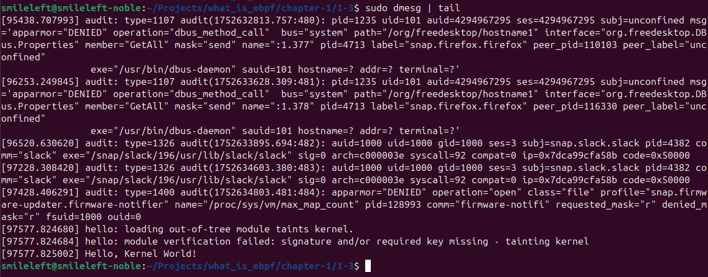
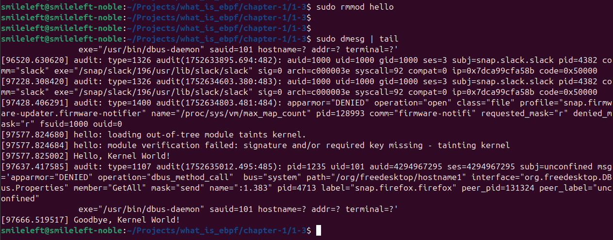

# 1.3 커널공간 vs 유저공간 (Kernel Space vs User Space)

### ✅ 개요

리눅스 운영체제는 **메모리 보호**와 **안정성**을 위해 실행 환경을 두 가지 공간으로 나눈다.

| 구분 | 유저 공간 (User Space) | 커널 공간 (Kernel Space) |
| --- | --- | --- |
| 주체 | 일반 프로세스, 애플리케이션 | 운영체제 커널, 드라이버, 시스템 콜 처리 등 |
| 접근 권한 | 제한적 (직접 하드웨어 접근 불가) | 전권 (모든 자원 접근 가능) |
| 예 | bash, curl, nginx, Python script 등 | 시스템 콜 처리, 파일시스템, 네트워크 스택, 드라이버 |
| 안전성 | 에러 발생 시 해당 프로세스만 죽음 | 에러 발생 시 커널 패닉, 시스템 전체 다운 가능 |
| 진입 방법 | 시스템 콜, 인터럽트, 신호 | 직접 실행, 또는 커널 쓰레드로 작동 |

즉, user space는 일반 앱을 위한 공간이고, 커널 space는 운영체제의 본체이다.

 

1. 커널 모듈 (Kernel Module)
    1. 정의 : Kernel Module 은 리눅스 커널 기능을 동적으로 확장하거나 추가할 수 있는 로드 가능한 커널 코드 조각.
    2. 예: 장치 드라이버, 파일시스템, 보안 기능, 모니터링 도구 등
    3. 특징
        1. 커널 실행 중 동적 삽입/제거 가능( insmod, rmmod )
        2. .ko (kernel object) 파일로 컴파일됨
        3. 커널 공간에서 실행되므로 위험하지만 고성능
        4. 예: usb-storage.ko, e1000e.ko, xt_LOG.ko
    4. 예제 
    
    ```c
    // hello.c - 간단한 커널 모듈
    #include <linux/init.h>
    #include <linux/module.h>
    
    MODULE_LICENSE("GPL");
    
    static int __init hello_init(void) {
        printk(KERN_INFO "Hello, Kernel World!\n");
        return 0;
    }
    
    static void __exit hello_exit(void) {
        printk(KERN_INFO "Goodbye, Kernel World!\n");
    }
    
    module_init(hello_init);
    module_exit(hello_exit);
    
    // Makefile -> 작성 후 아래 예시처럼 make 실행하면 hello.ko 파일 생성됨(단, build-essential, linux-headers-$(uname -r) 패키지가 설치되어 있어야 함)
    // Debian/Ubuntu 계열
    sudo apt install build-essential linux-headers-$(uname -r)
    
    // RHEL/Fedora/CentOS 계열
    sudo dnf install kernel-devel
    
    // Makefile 내용
    obj-m += hello.o
    
    all:
    	make -C /lib/modules/$(shell uname -r)/build M=$(PWD) modules
    
    clean:
    	make -C /lib/modules/$(shell uname -r)/build M=$(PWD) clean
    ```
    

```bash
# build 및 실행
make # 실행 후 hello.o, hello.ko 파일이 생성되었는지 확인한다
sudo insmod hello.ko
dmesg | tail # -> systemd 기반 시스템에서는 sudo journalctl -k -b | grep "Kernel World" 로 생성한 hello.ko 모듈이 로드되었는지 확인한다.
sudo rmmod hello

```

실행결과

로드(sudo insmod hello.ko)



언로드(suro rmmod hello)



2. 커널 모듈과 eBPF 비교

| 항목 | 커널 모듈 | eBPF 프로그램 |
| --- | --- | --- |
| 실행 위치 | 커널 공간 | 커널 공간 |
| 로딩 방식 | 컴파일 후 insmod/rmmod | 런타임에 동적 로딩 (유저 공간에서 로드) |
| 안정성 | 커널 크래시 위험 존재 | Verifier 통해 안전성 보장 |
| 개발 난이도 | 높음 (커널 빌드 필요) | 낮음 (간단한 C 코드로 가능) |
| 용도 | 장치 드라이버, 커널 확장 | 네트워크 필터, 시스템 추적, 보안 모니터 |