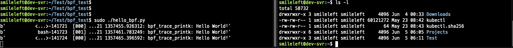

# 4.1 hello_world 프로그램 작성

- 선행 조건 : 3.1과 3.2 의 필수 프로그램 설치 완료되어야 함
    - [https://www.notion.so/3-1-2042c18e27da80a98befcedef51d3cc1?pvs=25](https://www.notion.so/3-1-2042c18e27da80a98befcedef51d3cc1?pvs=21)
    - [https://www.notion.so/3-2-clang-llvm-libbpf-bpftool-2042c18e27da80a1aa30e9c7baab722c?pvs=25](https://www.notion.so/3-2-clang-llvm-libbpf-bpftool-2042c18e27da80a1aa30e9c7baab722c?pvs=21)

## eBPF [hello.py](http://hello.py) 작성

위의 선행 조건들을 모두 완료했다면 아래와 같이 [hello.py](http://hello.py) 파일을 작성하자.

```python
#!/usr/bin/python3  
from bcc import BPF

program = r"""
int hello(void *ctx) {
    bpf_trace_printk("Hello World!");
    return 0;
}
"""

b = BPF(text=program)
syscall = b.get_syscall_fnname("execve")
b.attach_kprobe(event=syscall, fn_name="hello")

b.trace_print()
```

## 실행

터미널 2개를 열어서 한 창에선 hello.py를 실행, 다른 터미널에선 임의의 명령을 실행(ps -ef, ls -l 등)하자.

hello.py에서 작성한 대로 ‘Hello World!’ 가 올라오는 것을 확인할 수 있다.



## 코드 설명

```python

"""
BPF 객체 생성
c 형태의 eBPF 프로그램 정의
bpf_trace_printk 는 커널 trace pipe 에 메시지를 출력하는 함수
"""
program = r"""
int hello(void *ctx) {
    bpf_trace_printk("Hello World!");
    return 0;
}
"""

"""
시스템 콜 execve에 kprobe 연결, execve는 새로운 프로그램을 실행하는 Linux 시스템 콜(/bin/ls 같은 명령 실행 시 사용됨)
get_syscall_fnname("execve")는 플랫폼별 시스템 콜 함수 이름을 찾아줌(예: __x64_sys_execvem sys_execve 등)
attach_kprobe를 통새 해당 시스템 콜이 호출될 때 위에서 정의한 hello 함수가 실행되게 함
"""
b = BPF(text=program)
syscall = b.get_syscall_fnname("execve")
b.attach_kprobe(event=syscall, fn_name="hello")

# 출력 대기
b.trace_print()
```


## 참고

- bpf_trace_printk( ) 는 디버깅 용도로 성능이 낮고 출력 제한(한 줄 80 바이트 등)이 있슴. 실전에서는 perf buffer, ring buffer 등을 사용함
- 출력은 /sys/kernel/debug/tracing/trace_pipe 에서 실시간으로 확인할 수 있슴

```bash
sudo cat /sys/kernel/debug/tracing/trace_pipe
```