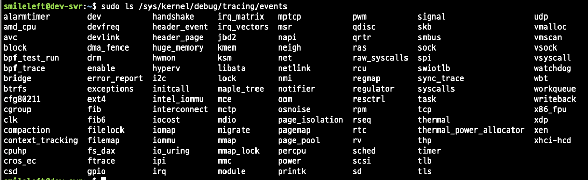

# 4.2 tracepoint/kprobe/uprobes

# tracepoint

공식문서 - [https://docs.kernel.org/trace/tracepoints.html](https://docs.kernel.org/trace/tracepoints.html)

- 목적 : 커널에 내장된 고정된 추적 포인트. 커널의 이벤트 지점을 후킹함
- 특징
    - 성능 부담이 가장 적고, 안정성이 높음
    - On/Off 가능
    - 리눅스 시스템의 /sys/kernel/debug/tracing/events 에서 사용 가능한 tracepoint 확인 가능
    - 필드(파라미터) 구조가 고정되어 있기에 접근과 사용은 간단하지만 확장성에 제한



아래는  include/trace.h 파일 (-> tracepoint 를 사용하기 위한 기본 헤더 파일)

```c

/* SPDX-License-Identifier: GPL-2.0 */
#ifndef _LINUX_TRACE_H
#define _LINUX_TRACE_H

#define TRACE_EXPORT_FUNCTION   BIT(0)
#define TRACE_EXPORT_EVENT      BIT(1)
#define TRACE_EXPORT_MARKER     BIT(2)

/*
 * The trace export - an export of Ftrace output. The trace_export
 * can process traces and export them to a registered destination as
 * an addition to the current only output of Ftrace - i.e. ring buffer.
 *
 * If you want traces to be sent to some other place rather than ring
 * buffer only, just need to register a new trace_export and implement
 * its own .write() function for writing traces to the storage.
 *
 * next         - pointer to the next trace_export
 * write        - copy traces which have been delt with ->commit() to
 *                the destination
 * flags        - which ftrace to be exported
 */
struct trace_export {
        struct trace_export __rcu       *next;
        void (*write)(struct trace_export *, const void *, unsigned int);
        int flags;
};

struct trace_array;

#ifdef CONFIG_TRACING

int register_ftrace_export(struct trace_export *export);
int unregister_ftrace_export(struct trace_export *export);

/**
 * trace_array_puts - write a constant string into the trace buffer.
 * @tr:    The trace array to write to
 * @str:   The constant string to write
 */
#define trace_array_puts(tr, str)                                       \
        ({                                                              \
                str ? __trace_array_puts(tr, _THIS_IP_, str, strlen(str)) : -1; \
        })
int __trace_array_puts(struct trace_array *tr, unsigned long ip,
                       const char *str, int size);

void trace_printk_init_buffers(void);
__printf(3, 4)
int trace_array_printk(struct trace_array *tr, unsigned long ip,
                       const char *fmt, ...);
int trace_array_init_printk(struct trace_array *tr);
void trace_array_put(struct trace_array *tr);
struct trace_array *trace_array_get_by_name(const char *name, const char *systems);
int trace_array_destroy(struct trace_array *tr);

/* For osnoise tracer */
int osnoise_arch_register(void);
void osnoise_arch_unregister(void);
void osnoise_trace_irq_entry(int id);
void osnoise_trace_irq_exit(int id, const char *desc);

#else /* CONFIG_TRACING */
static inline int register_ftrace_export(struct trace_export *export)
{
        return -EINVAL;
}
static inline int unregister_ftrace_export(struct trace_export *export)
{
        return 0;
}
static inline void trace_printk_init_buffers(void)
{
}
static inline __printf(3, 4)
int trace_array_printk(struct trace_array *tr, unsigned long ip, const char *fmt, ...)
{
        return 0;
}
static inline int trace_array_init_printk(struct trace_array *tr)
{
        return -EINVAL;
}
static inline void trace_array_put(struct trace_array *tr)
{
}
static inline struct trace_array *trace_array_get_by_name(const char *name, const char *systems)
{
        return NULL;
}
static inline int trace_array_destroy(struct trace_array *tr)
{
        return 0;
}
#endif  /* CONFIG_TRACING */

#endif  /* _LINUX_TRACE_H */
```

- 커널소스에 트레이싱을 추가하는 법
    - tracepoint 를 헤더파일(→ 이 파일에 위에 있는 tracepoint.h 파일을 include 해야 함)에 정의하고, C코드로 구현하여 사용
    - 사용사례 : subsys/file.c
        - subsys → name of your subsystem
        - eventname → name of the event to trace

```c
#include <trace/events/subsys.h>

#define CREATE_TRACE_POINTS
DEFINE_TRACE(subsys_eventname);

void somefct(void)
{
        ...
        trace_subsys_eventname_tp(arg, task); 
        ...
}
```

include/trace/events/subsys.h

```c
#undef TRACE_SYSTEM
#define TRACE_SYSTEM subsys

#if !defined(_TRACE_SUBSYS_H) || defined(TRACE_HEADER_MULTI_READ)
#define _TRACE_SUBSYS_H

#include <linux/tracepoint.h>

DECLARE_TRACE(subsys_eventname,
        TP_PROTO(int firstarg, struct task_struct *p),
        TP_ARGS(firstarg, p));

#endif /* _TRACE_SUBSYS_H */

/* This part must be outside protection */
#include <trace/define_trace.h>
```

참고 - 오라클 기술 블로그

- [https://blogs.oracle.com/linux/post/taming-tracepoints-in-the-linux-kernel](https://blogs.oracle.com/linux/post/taming-tracepoints-in-the-linux-kernel)

- BCC를 사용하여 tracepoint 확인하는 법

```python
from bcc import BPF

program = """
TRACEPOINT_PROBE(syscalls, sys_enter_execve) {
    bpf_trace_printk("execve tracepoint\\n");
    return 0;
}
"""

b = BPF(text=program)
b.trace_print()
```

# kprobes

공식문서 - [https://docs.kernel.org/trace/kprobes.html](https://docs.kernel.org/trace/kprobes.html)

- 목적 : 커널 함수의 진입 지점 또는 종료 지점에 후킹하여 eBPF 코드를 실행함
- 특징
    - 동적으로 커널 내부 함수를 감시할 수 있슴
    - 함수 인자, 레지스터, 스택 접근 가능
    - kretprobe로 함수 리턴 지점 후킹도 가능
- 사용가능한 kprobe 함수 목록 확인 방법
    - cat /proc/kallsyms | grep -w “ T “

# uprobes

공식문서 - [https://docs.kernel.org/trace/uprobetracer.html](https://docs.kernel.org/trace/uprobetracer.html)

- 목적 :  User Space 프로그램의 실행 상태를 추적
- 특징
    - 동적 바이너리 주소 분석(objdump, nm)으로 심볼 위치 확인 필요
    - attach_uretprobe( ) 로 함수 리턴 시점에 추적이 가능

## 비교요약

| **항목** | **kprobe** | **tracepoint** | **uprobe** |
| --- | --- | --- | --- |
| 대상 | 커널 함수 | 커널 trace 지점 | 사용자 공간 함수 |
| 안정성 | 중간 (커널 업데이트에 민감) | 높음 (고정 구조) | 중간 (심볼 주소 변경 가능성) |
| 성능 | 보통 | 가장 우수 | 보통 |
| 유연성 | 높음 (함수 위치 지정 가능) | 중간 (고정된 이벤트만 가능) | 높음 (사용자 함수 어디든 가능) |
| 활용 예 | syscall 감시, network 처리 등 | context switch 감시, I/O 감시 | 앱 수준 tracing, 디버깅 |
