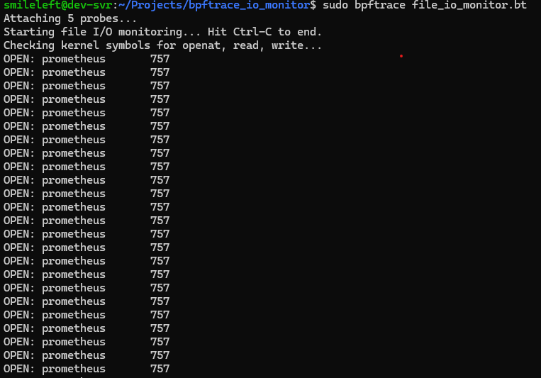

# 4.3 bpftrace를 활용한 고수준 스크립팅

- bpftrace 공식 github: [GitHub - bpftrace/bpftrace: High-level tracing language for Linux](https://github.com/bpftrace/bpftrace)
- install
    - 
    
    ```bash
    sudo apt update
    sudo apt install bpftrace
    
    # 실행 후 설치 확인 (ubuntu 의 경우 /usr/bin/bpftrace)
    which bpftrace
    ```
    

# bpftrace 를 활용한 file I/O 모니터링 스크립트 file_io_monitor.bt

```bash
#!/usr/bin/bpftrace

// 이 스크립트는 시스템의 파일 I/O 활동을 모니터링합니다.
// - 파일 열기: 어떤 프로세스가 어떤 파일을 열었는지 출력합니다.
// - 읽기/쓰기: 각 프로세스가 읽거나 쓴 총 바이트를 추적합니다.
// 종료 시(Ctrl+C) 요약 보고서를 출력합니다.

// 필요한 커널 심볼의 존재 여부를 미리 확인합니다.
// 이는 스크립트가 로드될 때 심볼이 없으면 오류를 방지하는 데 도움이 됩니다.
// sys_openat, sys_read, sys_write는 일반적인 커널 심볼입니다.
// 사용하는 커널 버전에 따라 이름이 다를 수 있습니다 (예: __x64_sys_openat).
// bpftrace는 매칭되는 심볼을 자동으로 찾아주려 시도하지만, 명시적으로 확인하는 것이 좋습니다.
BEGIN
{
    printf("Starting file I/O monitoring... Hit Ctrl-C to end.\n");
    printf("Checking kernel symbols for openat, read, write...\n");

    // 심볼 존재 여부 확인 (bpftrace가 자동 매핑 시도)
    // 여기서는 예시를 위해 일반적인 이름을 사용합니다.
    // 만약 "sys_openat"이 없다면 "__x64_sys_openat" 등을 시도해야 할 수 있습니다.
    // 실제 환경에서는 'sudo cat /proc/kallsyms | grep openat' 등으로 확인하는 것이 좋습니다.
}

// -----------------------------------------------------------------------------
// 1. 파일 열기 모니터링 (sys_openat -> 실행환경에 맞는 심볼을 확인하여 적용, ubuntu 64bit 환경에선 __x64_sys_openat)
//    - kprobe는 함수 호출 직전에 실행됩니다.
//    - arg1은 'filename' 인수에 해당합니다.
//    - @opens: 파일명과 프로세스 이름을 키로 열기 횟수를 집계합니다.
// -----------------------------------------------------------------------------
kprobe:__x64_sys_openat
/pid != 0/ // PID 0은 커널 스레드이므로, 사용자 프로세스만 필터링합니다.
{
    // filename은 sys_openat의 두 번째 인자 (arg1)에 해당합니다.
    // str() 함수는 사용자 공간 문자열을 읽어옵니다.
    $filename = str(arg1);
    printf("OPEN: %-16s %-6d %s\n", comm, pid, $filename);

    // 연 파일의 이름을 키로 사용하고, 프로세스 이름을 하위 키로 사용하여 횟수를 집계합니다.
    // bpftrace에서 다중 키를 사용할 때는 쉼표로 구분하고, count() 함수를 명시적으로 사용합니다.
    @opens[$filename, comm] = count();
}

// -----------------------------------------------------------------------------
// 2. 파일 읽기 모니터링 (sys_read)
//    - kretprobe는 함수 반환 직후에 실행됩니다.
//    - retval은 함수의 반환 값 (읽은 바이트 수)을 포함합니다.
//    - @read_bytes: 프로세스 이름을 키로 읽은 총 바이트 수를 집계합니다.
// -----------------------------------------------------------------------------
kretprobe:__x64_sys_read
/retval >= 0 && pid != 0/ // 읽은 바이트 수가 0 이상이고 사용자 프로세스인 경우
{
    // retval은 읽은 바이트 수입니다.
    @read_bytes[comm] = sum(retval);
}

// -----------------------------------------------------------------------------
// 3. 파일 쓰기 모니터링 (sys_write)
//    - kretprobe는 함수 반환 직후에 실행됩니다.
//    - retval은 함수의 반환 값 (쓴 바이트 수)을 포함합니다.
//    - @write_bytes: 프로세스 이름을 키로 쓴 총 바이트 수를 집계합니다.
// -----------------------------------------------------------------------------
kretprobe:__x64_sys_write
/retval >= 0 && pid != 0/ // 쓴 바이트 수가 0 이상이고 사용자 프로세스인 경우
{
    // retval은 쓴 바이트 수입니다.
    @write_bytes[comm] = sum(retval);
}

// -----------------------------------------------------------------------------
// 4. 스크립트 종료 시 요약 보고서 (END)
//    - 사용자가 Ctrl-C를 눌러 스크립트를 종료할 때 실행됩니다.
//    - @opens, @read_bytes, @write_bytes 맵의 내용을 출력합니다.
// -----------------------------------------------------------------------------
END
{
    printf("\n\n--- Monitoring Summary ---\n");

    // bpftrace는 END 블록에 맵 이름만 명시하면 자동으로 맵의 내용을 출력합니다.
    printf("\n--- Files Opened by Process (Count) ---\n");
    print(@opens); // @opens 맵의 내용 출력

    printf("\n--- Total Bytes Read by Process ---\n");
    print(@read_bytes); // @read_bytes 맵의 내용 출력

    printf("\n--- Total Bytes Written by Process ---\n");
    print(@write_bytes); // @write_bytes 맵의 내용 출력

    printf("\nMonitoring ended.\n");
}
```

- file_io_monitor.bt 생성 후 위 내용 작성 하고 실행권한 부여 (chmod +x)
- 실행할 땐 관리자 권한으로 실행 (sudo bpftrace file_io_monitor.bt)

1. 실행화면



1. 다른 터미널에서 파일 열기 및 쓰기 작업 실행
2. 이후 Ctrl + c 로 종료
3. 종료 후 결과 출력 화면

