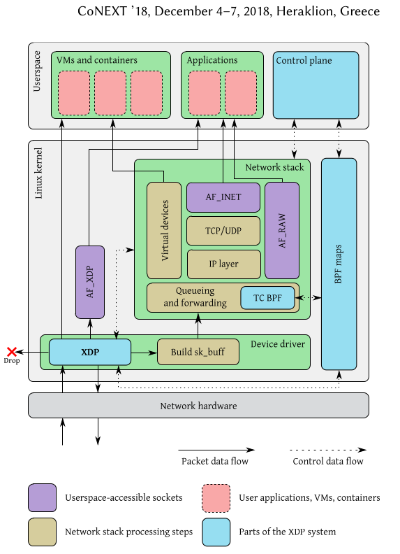

# 6.3 eBPF LoadBalancing

## eBPF 기반 로드밸런싱

전통적인 소프트웨어 로드밸런서(Nginx, HAProxy) 는 userspace에서 작동함. 이는 패킷이 커널과 userspace 사이를 오가며

컨텍스트 스위칭과 메모리 복사라는 오버헤드를 발생시킴. 이에 비해 고가의 하드웨어 로드밸런서는 유연성이 떨어지고 특정 기능에 대한 맞춤 설정과 기능확장이 어려움.

eBPF 기반 로드밸런싱은 이러한 문제들을 해결할 수 있슴.

패킷이 커널 네트워크 스택에 진입하는 가장 초기 단계나 특정 처리 지점에 eBPF 프로그램을 직접 연결하여,

패킷을 커널 내부에서 처리하고 백엔드 서버로 직접 전달함으로써 오버헤드를 최소화하고 처리량을 극대화함.

## eBPF 로드밸런싱의 핵심 작동 원리

- 커널 내 실행(In-Kernel Execution)
    - 로드밸런싱 로직이 사용자 공간 어플리케이션이 아닌 리눅스 커널 공간에서 직접 실행됨
    - 이는 패킷 처리 과정에서 발생하는 불필요한 컨텍스트 스위칭과 메모리 복사를 제거하여 낮은 latency와 높은 처리량 구현이 가능
- BPF Map 활용
    - BPF 맵은 커널 공간에 존재하는 key-value 저장소.
    - 백엔드 서버의 IP 주소 및 MAC 주소 목록, 각 서버의 헬스체크 상태, 로드밸런싱 알고리즘에 필요한 통게(라운드 로빈의 다음 index, connection count) 등을 저장하고 관리함
    - BPF 프로그램은 이 뱁을 통해 실시간으로 데이터를 조회하고 업데이트하며, userspace 어플리에이션(컨트롤 플레인)은 이 맵을 통해 백엔드 목록을 업데이트하거나 헬스체크 결과를 반영할 수 있슴
- 다양한 Hook Point : eBPF 로드밸런싱 프로그램은 패킷이 커널 네트워크 스택을 통과하는 특정 지점에 연결(Hook)됨
    - XDP(eXpress Data Path)
        - 위치 : 네트워크 드라이버가 패킷을 수신하는 가장 빠른 지점에서 실행됨(패킷이 sk_buff 구조체로 변환되기 전 → 패킷에 대한 메모리 할당이 이루어지기 전)
        - 특징: zero-copy 처리가 가능하여 극도로 낮은 latency와 높은 throughput 제공
        - 로드밸런싱 활용 방식 : 주로 DDoS 방어, 빠른 패킷 드롭, 또는 XDP_REDIRECT 액션을 사용하여 패킷을 다른 NIC 이나 CPU 큐로 직접 전달하는데 사용됨(L3/L4 의 IP/PORT 기반 로드밸런싱에 적합)
    - TC(Traffic Control) Hook
        - 위치 : 커널 네트워크 스택 내의 ingress 또는 egress 지점에서 실행(XDP 보다 늦은 지점, 패킷은 이미 sk_buff 구조체로 변환되어 메모리 할당된 상태)
        - 특징: sk_buff 컨텍스트를 통해 패킷의 더 많은 메타데이터(TCP/UDP header, socket)에 접근 가능. 드라이버 독립적이며 대부분의 네트워크 인터페이스에서 사용 가능
        - 로드밸런싱 활용 방식 : L4/L7 로드밸런싱 로직 → TCP/UPD 포트기반 혹은 Http 헤더 검사
- Helper Functions
    - eBPF 프로그램은 커널이 제공하는 안전하고 제한적인 API인 헬퍼 함수를 사용하여 패킷 조작, 맵 조회 및 업데이트, 난수 생성, 패킷 리다이렉션 등 다양한 작업을 수행

## eBPF 로드밸런싱 아키텍처

- Data Plane
    - 구성 : eBPF program + BPF Map
    - 역할 : 실제 트래픽을 처리하고 로드밸런싱 알고리즘에 따라 백엔드 서버로 패킷을 전달
    - 동작
        - 패킷이 네트워크 인터페이스에 도착하면 XDP 또는 TC Hook에서 eBPF 프로그램이 호출됨
        - eBPF 프로그램은 패킷 헤더를 검사하고 BPF 맵에 저장된 백엔드 서버 목록과 헬스체크 상태를 조회함
        - 미리 정의된 로드밸런싱 알고리즘(라운드 로빈, 해싱 …) 에 따라 적절한 백엔드 서버를 선택
        - 패킷의 목적지 IP 주소와 포트를 선택된 백엔드 서버의 정보로 변경(DNAT)하거나, 패킷을 백엔드 서버로 직접 전달(DSR)하는 등의 작업을 수행
        - 처리된 패킷을 커널 스택으로 통과/리다이렉트(다른 NIC) 시키거나 Drop
- Control Plane
    - 구성 : userspace에서 실행되는 어플리케이션(Go, Python 등으로 작성된 데몬)
    - 역할 : 로드밸런싱 정책 정의, 백엔드 서버 헬스체크, BPF 맵을 업데이트하여 Data Plane의 동작을 동적으로 제어
    - 동작
        - 백엔드 서버들의 헬스체크 수행
        - 새로운 백엔드 서버가 추가되거나 기존 서버의 상태가 변경되면 BPF 맵을 업데이트
        - 로드밸런싱 알고리즘이나 기타 설정 변경 요청이 있을 경우 BPF 맵을 통해 Data Plane에 반영

이미지 출처 : [https://dl.acm.org/doi/pdf/10.1145/3281411.3281443](https://dl.acm.org/doi/pdf/10.1145/3281411.3281443) → 논문제목 (The eXpress Data Path: Fast Programmable Packet Processing in the Operating System Kernel)

## 주요 로드밸런싱 알고리즘의 eBPF 구현

- DNAT (Dynamic Network Address Translation)
    - eBPF 프로그램이 들어오는 패킷의 목적지 IP/Port 를 백엔드 서버의 IP/Port 로 변경하고, 나가는 응답 패킷의 소스 IP/Port 를 다시 로드밸런서의 IP/Port로 변경
    - BPF 맵에 가상 IP(VIP)와 백엔드 서버 pool 간의 매핑 정보를 저장
- DSR (Direct Server Return)
    - 요청 패킷은 DNAT 를 통해 백엔드 서버로 전달되지만, 백엔드 서버의 응답 패킷은 로드밸런서를 거치지 않고 클라이언트로 직접 전송됨
    - eBPF 프로그램은 요청 패킷만 처리하고, 백엔드 서버는 응답 시 로드밸런서의 IP 주소를 자신의 loop back 인터페이스에 설정하는 등의 추가 설정이 필요
    - 로드밸런서의 부하를 크게 줄여 고성능 구현에 유리
- Maglev Hashing (Consistent Hashing)
    - 패킷의 소스/목적지 IP/Port 등을 기반으로 해시값을 계산 → 해시값을 사용하여 백엔드 서버를 선택
    - BPF 맵을 Maglev lookup 테이블로 활용하여 백엔드 서버의 추가 및 제거 시 해시충돌을 최소화하고 트래픽 분배의 안정성을 높임

## eBPF 로드밸런싱의 장점과 한계

- 장점
    - **극대화된 성능**: 커널 내부 처리로 컨텍스트 스위칭 및 메모리 복사 오버헤드 제거
    - **높은 확장성**: 기존 소프트웨어 로드밸런서 대비 월등한 패킷 처리량
    - **뛰어난 유연성**: BPF 프로그램을 통해 복잡한 알고리즘 및 정책(L4/L7 기반, 헬스 체크, 동적 라우팅) 구현 가능
    - **자원 효율성**: 낮은 CPU 사용량으로 더 많은 자원을 애플리케이션에 할당
- 한계
    - **구현 복잡성**: 낮은 수준의 커널 프로그래밍으로 학습 곡선이 가파름
    - **디버깅의 어려움**: 커널 레벨 동작으로 인한 디버깅 난이도가 높음(BPF 맵, bpf_printk, perf 등으로 보완)
    - 커널/드라이버 의존성: 특정 기능은 커널 버전 및 네트워크 드라이버 지원에 따라 사용에 제약
    - 상태 관리: 복잡한 세션 유지(sticky session)나 L7 로드밸런싱을 위한 상태 관리는 BPF 맵을 통한 추가 설계 필요함

## 참고자료

- sk_buff
    - [https://pr0gr4m.github.io/linux/kernel/sk_buff/](https://pr0gr4m.github.io/linux/kernel/sk_buff/)
    - [https://docs.kernel.org/networking/skbuff.html](https://docs.kernel.org/networking/skbuff.html)
-
